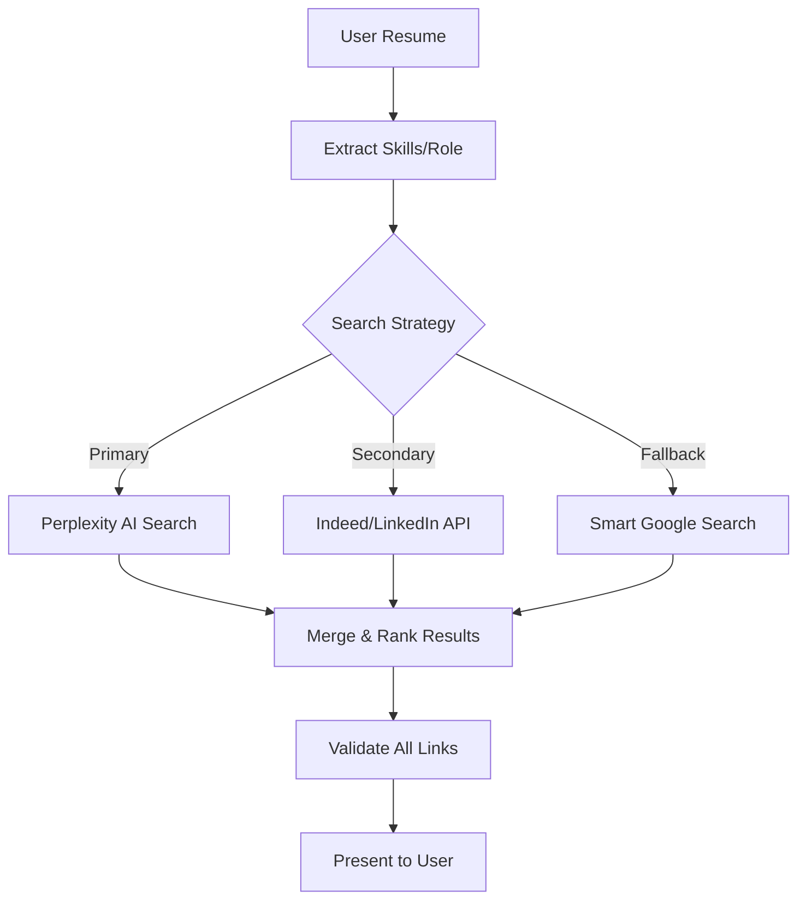

# Job Search Feature Design Discussion

## Meeting Participants
- **Product Owner**: Defining business requirements
- **Darth Maul**: Forensic SW Engineer (Quality & Trust)
- **Dev Team**: Implementation team
- **UX Designer**: User experience perspective

---

## 1. NEEDED OUTCOME

### Product Owner's Vision
"We need a job search feature that helps users find AI-enhanced positions matching their skills, with real, clickable job listings they can apply to immediately."

### Success Criteria
- ✅ **Real Jobs**: Every result must be an actual job posting
- ✅ **Working Links**: 100% of "View Job" buttons must work
- ✅ **Accurate Data**: Company name, location, salary (when available)
- ✅ **AI Focus**: Prioritize jobs that mention AI tools/skills
- ✅ **Trust**: Users should trust our recommendations

### Current State vs. Desired State

**Current State (Broken)**
```
❌ Search result pages instead of jobs
❌ "Company Not Listed" for all results  
❌ Broken links (404 errors)
❌ Generic descriptions
❌ No salary information
```

**Desired State**
```
✅ Direct job posting links
✅ "Software Engineer at Google"
✅ Links to actual job applications
✅ Full job descriptions
✅ Salary ranges when available
```

---

## 2. DESIGN DISCUSSION

### Darth Maul's Forensic Analysis
"The root cause is architectural - we're using a general search API for specialized data. It's like using a hammer to perform surgery."

**Evidence:**
- Google returns: `indeed.com/jobs?q=automation+assistant`
- We need: `indeed.com/viewjob?jk=abc123def`
- Current extraction can't differentiate between search pages and job pages

### Technical Approaches Discussed

#### Approach 1: Dedicated Job APIs
**Dev Team Proposal:**
```python
# Instead of Google Custom Search
indeed_api.search(
    query="Administrative Assistant",
    location="San Jose, CA",
    filters={"requires": ["AI tools", "ChatGPT"]}
)
```

**Pros:**
- Structured job data
- Guaranteed working links
- Company/salary information
- Built for this exact purpose

**Cons:**
- API costs
- Rate limits
- Need multiple APIs for coverage

#### Approach 2: Smart Google Search + Validation
**Alternative Proposal:**
```python
# Smarter query construction
query = '''
site:greenhouse.io/*/jobs/* OR 
site:lever.co/* OR
site:indeed.com/viewjob?jk=* OR
site:linkedin.com/jobs/view/*
"Administrative Assistant" 
"San Jose"
-inurl:search
'''

# Post-processing validation
for job in results:
    if not validate_job_url(job.link):
        continue
    if not extract_company_name(job):
        fetch_and_parse_page(job.link)
```

**Pros:**
- Uses existing infrastructure
- Free (within limits)
- Wide coverage

**Cons:**
- Complex implementation
- Still unreliable
- Performance overhead

#### Approach 3: Hybrid Solution (Recommended)
**Consensus Approach:**



### UX Designer's Input
"Users don't care about the backend - they want:"
1. **Speed**: Results in < 3 seconds
2. **Relevance**: Jobs they can actually get
3. **Trust**: No broken links, ever
4. **Clarity**: Clear next steps to apply

### Proposed UI Changes
```
Current: [View Job] → 404 Error ❌

Proposed: [Apply on Indeed ↗] → Direct to application ✅
          [Apply on LinkedIn ↗] → Direct to application ✅
          [View Full Details] → Our cached/parsed version ✅
```

---

## 3. IMPLEMENTATION PLAN

### Phase 1: Stop the Bleeding (Week 1)
- [ ] Disable Google search temporarily
- [ ] Add "Beta" label to set expectations
- [ ] Implement link validation
- [ ] Cache working results

### Phase 2: Add Reliable Sources (Week 2-3)
- [ ] Integrate Indeed API
- [ ] Add LinkedIn Jobs API (if available)
- [ ] Implement Adzuna as backup
- [ ] Build result merger/ranker

### Phase 3: Enhance Intelligence (Week 4-5)
- [ ] Improve Perplexity prompts
- [ ] Add AI skill matching algorithm
- [ ] Implement salary prediction
- [ ] Add "Why this job?" explanations

### Phase 4: Polish & Scale (Week 6)
- [ ] Performance optimization
- [ ] Add more job sources
- [ ] Implement user feedback loop
- [ ] A/B test different approaches

---

## 4. METRICS & MONITORING

### Key Metrics to Track
1. **Link Success Rate**: Target 99%+
2. **Search to Application**: Track funnel
3. **Result Relevance**: User feedback scores
4. **API Costs**: Per search/per hire
5. **Performance**: Response time < 3s

### Darth Maul's Testing Requirements
```python
def test_job_link_validity():
    """Every link must be valid before showing to user"""
    for job in search_results:
        response = requests.head(job.link)
        assert response.status_code == 200
        assert "404" not in response.text
        assert job.company != "Company Not Listed"
        assert job.location != "Location Not Specified"
```

---

## 5. DECISION & NEXT STEPS

### Agreed Approach
**Hybrid solution with phased rollout:**
1. Fix immediate issues (validation, filtering)
2. Add 1-2 reliable job APIs
3. Keep Perplexity for AI matching
4. Improve Google as fallback only

### Action Items
1. **Product Owner**: Approve API budget, prioritize features
2. **Dev Team**: Implement Phase 1 immediately
3. **Darth Maul**: Create comprehensive test suite
4. **UX Designer**: Design "applying" flow mockups

### Success Criteria Review (30 days)
- Link success rate > 95%
- User trust score > 4.5/5
- At least 100 real job applications submitted
- Positive user feedback on AI job matching

---

## Appendix: Example of Desired Output

```json
{
  "job": {
    "title": "Administrative Assistant - AI Tools",
    "company": "Tesla",
    "location": "Fremont, CA",
    "salary": "$65,000 - $85,000",
    "description": "Support executive team using AI productivity tools including ChatGPT, Claude, and Microsoft Copilot...",
    "link": "https://tesla.com/careers/job/12345",
    "linkStatus": "verified",
    "postedDate": "2025-07-20",
    "aiTools": ["ChatGPT", "Claude", "Microsoft Copilot"],
    "matchScore": 0.92,
    "matchReason": "Your experience with Microsoft Office and AI tools makes you a strong candidate"
  }
}
```

This is what builds user trust - real jobs, real companies, real opportunities.